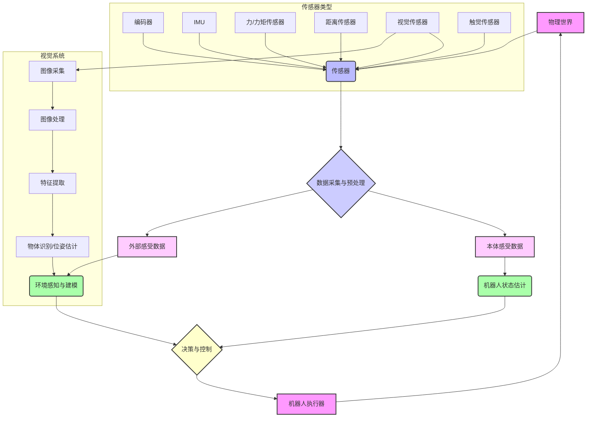

# 1.2 机器人传感器与视觉介绍

- **作者**: Damon Li
- **日期**: 2026年2月4日

## 1. 概述

机器人传感器是机器人感知环境和自身状态的关键组件，它们赋予机器人“感官”，使其能够收集信息并做出智能决策 [1]。如同人类的五感，机器人传感器将物理世界的各种属性（如距离、光线、声音、力、温度等）转化为电信号，供机器人系统处理和理解 [2]。机器人视觉系统作为传感器的一种特殊且重要的形式，使机器人能够“看”并解释视觉数据，从而执行识别、导航、检测和操作等复杂任务 [3]。

传感器的选择和集成对于机器人的性能至关重要，它直接影响机器人在复杂、动态环境中自主工作的能力。一个完善的传感器系统是实现具身智能的基础，它为机器人的运动规划、控制、学习和人机交互提供了必要的数据支持。

## 2. 核心原理

机器人传感器的工作原理是将物理量转换为可测量的电信号。这些信号随后经过处理、滤波和解释，以提取有意义的信息。机器人视觉系统则更进一步，它通过摄像头捕获图像或视频，并利用计算机视觉算法对这些视觉数据进行分析，从而理解场景中的物体、位置、姿态等信息。

### 2.1 传感器分类

机器人传感器通常可以根据其测量对象或功能分为两大类：

- **本体感受传感器 (Proprioceptive Sensors)**：测量机器人内部状态的传感器，例如关节角度、电机速度、电池电量、力矩等。它们提供关于机器人自身运动和状态的信息 [4]。
- **外部感受传感器 (Exteroceptive Sensors)**：测量机器人外部环境的传感器，例如距离、光线、声音、接触、视觉信息等。它们帮助机器人感知周围世界，避免碰撞，识别物体，并进行导航 [4]。

### 2.2 视觉系统基本构成

一个典型的机器人视觉系统通常包括以下几个部分 [3]：

1.  **图像采集设备**：如摄像头（单目、双目、RGB-D相机）、激光雷达等，用于捕获原始视觉数据。
2.  **图像预处理**：对原始图像进行降噪、增强、校正等操作，以提高图像质量。
3.  **特征提取**：从图像中提取有意义的特征，如边缘、角点、纹理、颜色、形状等。
4.  **图像理解与分析**：利用机器学习、深度学习等算法对提取的特征进行分析，实现物体识别、位姿估计、场景分割、运动跟踪等高级视觉任务。
5.  **决策与控制**：根据视觉分析结果，生成相应的决策指令，驱动机器人执行动作。

## 3. 关键传感器类型

以下是一些在机器人领域广泛应用的关键传感器类型：

### 3.1 距离传感器 (Distance Sensors)

用于测量机器人与环境中物体之间的距离，常见的有：

-   **超声波传感器**：通过发射和接收超声波来测量距离，成本低，但精度受环境影响较大。
-   **红外传感器**：通过发射和接收红外光来测量距离，易受环境光干扰。
-   **激光雷达 (LiDAR)**：通过发射激光束并测量反射时间来构建高精度的环境3D点云图，广泛应用于自动驾驶和SLAM (Simultaneous Localization and Mapping) [5]。

### 3.2 视觉传感器 (Vision Sensors)

提供丰富的环境信息，是机器人感知能力的核心：

-   **单目摄像头**：提供2D图像，通过计算机视觉算法可实现物体识别、跟踪等。但无法直接获取深度信息。
-   **双目摄像头**：模仿人类双眼，通过视差原理计算深度信息，获取3D感知能力。
-   **RGB-D相机**：如Kinect、RealSense等，直接提供彩色图像 (RGB) 和深度图像 (Depth)，极大地简化了3D感知任务 [6]。

### 3.3 力/力矩传感器 (Force/Torque Sensors)

测量机器人末端执行器或关节处受到的力和力矩，对于精细操作、人机协作和安全至关重要。它们使机器人能够感知接触、执行力控任务，如装配、抛光等 [1]。

### 3.4 触觉传感器 (Tactile Sensors)

模拟人类皮肤的触觉，感知接触点的压力、纹理和滑动。对于抓取物体时的稳定性和精细操作非常有用。

### 3.5 惯性测量单元 (IMU)

包含加速度计和陀螺仪，用于测量机器人的角速度和线性加速度，从而估计机器人的姿态和运动状态，常用于导航和姿态控制 [1]。

## 4. 传感器系统架构示例

以下是一个简化的机器人传感器系统架构图，展示了不同传感器如何协同工作，为机器人提供全面的感知能力。

## 5. 参考资料

- [1] Standard Bots. (2025). *Every Type of Sensors in Robotics - Explained*. [URL](https://standardbots.com/blog/every-type-of-sensors-in-robotics---explained)
- [2] Coderobo.ai. (2025). *Sensing 101: A Beginner's Guide to Sensors Used in Robotics*. [URL](https://www.coderobo.ai/blogs/sensing-101-beginners-guide-sensors-used-in-robotics)
- [3] Bota Systems. (2025). *What Are Robot Vision Systems? A Comprehensive Guide*. [URL](https://www.botasys.com/post/robot-vision)
- [4] Stanford University. (n.d.). *7 Introduction to Robot Sensors*. [PDF](https://stanfordasl.github.io/PoRA-I/aa274a_aut2223/pdfs/notes/lecture7.pdf)
- [5] Wikipedia. (n.d.). *Lidar*. Retrieved from [URL](https://en.wikipedia.org/wiki/Lidar)
- [6] Wikipedia. (n.d.). *RGB-D camera*. Retrieved from [URL](https://en.wikipedia.org/wiki/RGB-D_camera)
