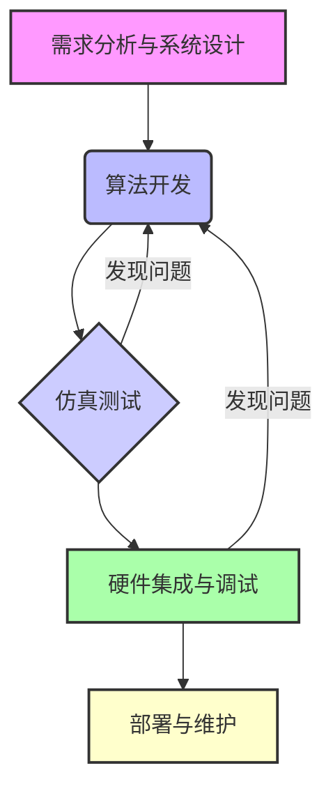

# 1.4 实践工具

- **作者**: Damon Li
- **日期**: 2026年2月4日

## 1. 概述

在机器人抓取与操作领域，高效的开发离不开一系列强大的实践工具。这些工具涵盖了从软件开发、系统集成、仿真测试到硬件部署的整个生命周期。它们旨在简化机器人系统的设计、编程、调试和优化过程，使研究人员和工程师能够专注于算法创新和任务实现，而非底层细节 [1]。

本节将介绍机器人开发中常用的几类实践工具，包括机器人操作系统（ROS）、仿真环境以及其他辅助工具。

## 2. 机器人开发流程

一个典型的机器人开发流程通常包括以下阶段：

1.  **需求分析与系统设计**：明确机器人需要完成的任务、环境约束和性能指标，设计机器人硬件和软件架构。
2.  **算法开发**：开发感知、决策、控制等核心算法，例如运动规划、物体识别、抓取策略等。
3.  **仿真测试**：在虚拟环境中对算法和系统进行测试和验证，以减少在真实硬件上测试的风险和成本。
4.  **硬件集成与调试**：将软件部署到真实机器人硬件上，进行系统集成、参数调优和故障排除。
5.  **部署与维护**：将机器人系统投入实际应用，并进行持续的监控、更新和维护。



## 3. 机器人操作系统 (ROS)

机器人操作系统（Robot Operating System, ROS）是一个灵活的框架，用于编写机器人软件。它提供了一系列库和工具，以帮助软件开发者创建复杂的机器人行为。ROS不是一个传统的操作系统，而是一个元操作系统，它运行在Linux等操作系统之上，提供进程间通信、硬件抽象、设备驱动、库、可视化工具、消息传递和包管理等功能 [2] [3]。

### 3.1 ROS核心概念

-   **节点 (Nodes)**：执行计算任务的进程。例如，一个节点可能负责控制电机，另一个节点可能负责处理摄像头数据。
-   **话题 (Topics)**：节点之间传递消息的命名总线。节点可以发布（publish）消息到话题，也可以订阅（subscribe）话题来接收消息。
-   **消息 (Messages)**：ROS中用于节点间通信的数据结构。
-   **服务 (Services)**：一种请求/响应通信机制，用于节点之间进行同步通信。
-   **参数服务器 (Parameter Server)**：用于存储和检索机器人系统参数的共享字典。

### 3.2 ROS代码示例 (Python)

以下是一个简单的ROS发布者（Publisher）和订阅者（Subscriber）的Python示例。发布者节点每秒发布一个“Hello ROS”消息，订阅者节点接收并打印这些消息。

首先，创建一个ROS工作空间和包：

```bash
mkdir -p ~/catkin_ws/src
cd ~/catkin_ws/src
catkin_create_pkg my_ros_pkg rospy std_msgs
cd my_ros_pkg
mkdir scripts
```

然后，创建发布者脚本 `scripts/publisher_node.py`：

```python
#!/usr/bin/env python
import rospy
from std_msgs.msg import String

def publisher_node():
    # 初始化ROS节点，命名为'publisher_node'
    rospy.init_node('publisher_node', anonymous=True)
    # 创建一个发布者，发布String类型消息到'chatter'话题，队列大小为10
    pub = rospy.Publisher('chatter', String, queue_size=10)
    rate = rospy.Rate(1) # 1hz

    rospy.loginfo("Publisher Node Started")

    while not rospy.is_shutdown():
        hello_str = "Hello ROS from Publisher %s" % rospy.get_time()
        rospy.loginfo(hello_str)
        pub.publish(hello_str)
        rate.sleep()

if __name__ == '__main__':
    try:
        publisher_node()
    except rospy.ROSInterruptException:
        pass
```

创建订阅者脚本 `scripts/subscriber_node.py`：

```python
#!/usr/bin/env python
import rospy
from std_msgs.msg import String

def callback(data):
    rospy.loginfo(rospy.get_caller_id() + "I heard %s", data.data)

def subscriber_node():
    # 初始化ROS节点，命名为'subscriber_node'
    rospy.init_node('subscriber_node', anonymous=True)
    # 创建一个订阅者，订阅'chatter'话题的String类型消息，并指定回调函数
    rospy.Subscriber('chatter', String, callback)

    rospy.loginfo("Subscriber Node Started")

    # 保持节点运行直到被关闭
    rospy.spin()

if __name__ == '__main__':
    try:
        subscriber_node()
    except rospy.ROSInterruptException:
        pass
```

给脚本添加执行权限：

```bash
chmod +x ~/catkin_ws/src/my_ros_pkg/scripts/publisher_node.py
chmod +x ~/catkin_ws/src/my_ros_pkg/scripts/subscriber_node.py
```

在`~/catkin_ws/src/my_ros_pkg/CMakeLists.txt`中添加以下行，确保脚本被安装：

```cmake
catkin_install_python(PROGRAMS scripts/publisher_node.py scripts/subscriber_node.py
  DESTINATION ${CATKIN_PACKAGE_BIN_DESTINATION})
```

编译工作空间：

```bash
cd ~/catkin_ws
catkin_make
source devel/setup.bash
```

运行：

打开一个终端，启动ROS Master：

```bash
roscore
```

打开另一个终端，运行发布者节点：

```bash
rosrun my_ros_pkg publisher_node.py
```

打开第三个终端，运行订阅者节点：

```bash
rosrun my_ros_pkg subscriber_node.py
```

## 4. 仿真环境

机器人仿真环境允许开发者在虚拟世界中测试和验证机器人算法，而无需昂贵的物理硬件。这大大加速了开发周期，降低了风险，并使得在各种场景下进行测试成为可能 [4]。

-   **Gazebo**：一个功能强大的3D机器人仿真器，能够精确模拟物理世界，包括重力、惯性、碰撞、传感器噪声等。它与ROS紧密集成，支持多种机器人模型和传感器 [5]。
-   **NVIDIA Isaac Sim**：基于NVIDIA Omniverse平台构建的机器人仿真和合成数据生成工具。它提供高保真物理模拟、逼真的渲染和强大的AI功能，特别适用于训练基于深度学习的机器人模型 [6]。
-   **Webots**：一个开源的机器人仿真平台，支持多种机器人和传感器模型，并提供了丰富的编程接口 [7]。
-   **Unity/Unreal Engine**：这些游戏引擎也被广泛用于机器人仿真，尤其是在需要高逼真度渲染和复杂交互场景时。它们提供了强大的图形渲染能力和物理引擎，可以创建高度沉浸式的仿真环境。

## 5. 其他工具

-   **版本控制系统 (Git)**：用于管理代码版本、协作开发和跟踪修改历史，是现代软件开发不可或缺的工具。
-   **集成开发环境 (IDE)**：如VS Code、PyCharm等，提供代码编辑、调试、自动补全等功能，提高开发效率。
-   **数据可视化工具**：如RViz (ROS Visualization)、Matplotlib、Plotly等，用于实时监控机器人状态、传感器数据和算法输出。
-   **CAD软件**：用于机器人机械结构设计和建模，例如SolidWorks、Fusion 360等。

## 6. 参考资料

- [1] Keymakr. (2025). *Leading Tools of the Modern Robotics Software*. [URL](https://keymakr.com/blog/leading-tools-of-the-modern-robotics-software/)
- [2] ROS Wiki. (n.d.). *ROS/Introduction*. Retrieved from [URL](http://wiki.ros.org/ROS/Introduction)
- [3] GeeksforGeeks. (2020). *Introduction to ROS (Robot Operating System)*. [URL](https://www.geeksforgeeks.org/operating-systems/introduction-to-ros-robot-operating-system/)
- [4] Formant. (2023). *Best Robot Simulators*. [URL](https://formant.io/blog/best-robot-simulators/)
- [5] Gazebo. (n.d.). *Gazebo: Robot Simulator*. Retrieved from [URL](http://gazebosim.org/)
- [6] NVIDIA. (n.d.). *NVIDIA Isaac Sim*. Retrieved from [URL](https://developer.nvidia.com/isaac-sim)
- [7] Cyberbotics. (n.d.). *Webots: Robot Simulator*. Retrieved from [URL](https://cyberbotics.com/)
