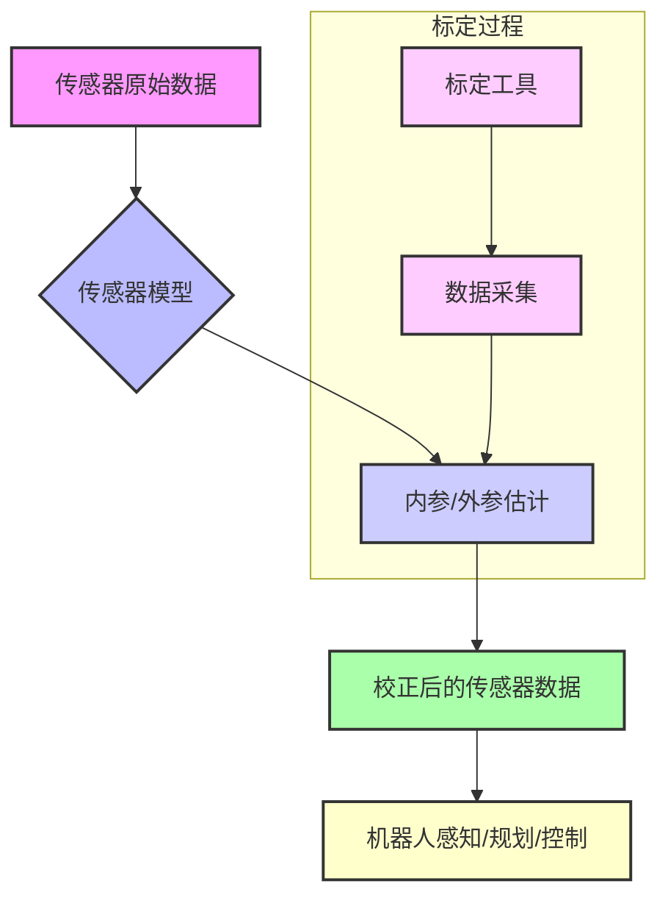

# 3.1 传感器和标定

- **作者**: Damon Li
- **日期**: 2026年2月4日

## 1. 概述

在机器人领域，传感器是机器人感知环境和自身状态的“眼睛”和“触觉”。然而，任何传感器都存在固有的误差和不确定性。**传感器标定 (Sensor Calibration)** 是一个至关重要的过程，旨在通过测量和校正这些误差，提高传感器数据的准确性和可靠性 [1]。准确的传感器数据是机器人进行精确感知、运动规划和控制的基础，尤其在机器人抓取与操作等对精度要求极高的任务中不可或缺。

本节将深入探讨机器人传感器标定的核心原理、相机模型、RGB-D相机标定以及力传感器标定等关键方法。

## 2. 核心原理

传感器标定的核心目标是建立传感器测量值与真实物理量之间的精确映射关系。这通常涉及确定传感器的**内参 (Intrinsic Parameters)** 和 **外参 (Extrinsic Parameters)**。

-   **内参 (Intrinsic Parameters)**：描述传感器自身的特性，例如相机镜头的焦距、主点、畸变系数，或力传感器的灵敏度、零点漂移等。这些参数是传感器固有的，不随其在机器人系统中的位置变化而改变 [2]。
-   **外参 (Extrinsic Parameters)**：描述传感器相对于机器人基坐标系或末端执行器坐标系的位置和姿态（即旋转和平移）。准确的外参是实现传感器数据与机器人运动学数据融合的关键 [2]。

传感器标定的一般流程通常包括：

1.  **数据采集**：使用已知的、高精度的标定工具（如棋盘格、球体）在不同位姿下采集传感器数据。
2.  **模型建立**：根据传感器类型建立数学模型，描述其测量过程和误差来源。
3.  **参数优化**：利用采集到的数据，通过优化算法估计传感器的内参和外参。
4.  **误差评估与验证**：评估标定结果的准确性，并在实际应用中验证其有效性。



## 3. 关键传感器校准方法

### 3.1 相机模型与标定 (Camera Models and Calibration)

相机标定是计算机视觉和机器人学中的基础任务，旨在确定相机的几何参数，以便将2D图像坐标精确地映射到3D世界坐标，反之亦然 [3]。

#### 3.1.1 针孔相机模型 (Pinhole Camera Model)

针孔相机模型是相机成像过程的理想化数学模型，它描述了3D世界点如何投影到2D图像平面。其核心是透视投影原理。一个3D世界点 $P_w = [X_w, Y_w, Z_w]^T$ 经过相机坐标系变换和透视投影后，在图像平面上的像素坐标 $[u, v]^T$ 可以表示为：

$$ s \begin{pmatrix} u \\ v \\ 1 \end{pmatrix} = \begin{pmatrix} f_x & 0 & c_x \\ 0 & f_y & c_y \\ 0 & 0 & 1 \end{pmatrix} \begin{pmatrix} R & t \\ 0^T & 1 \end{pmatrix} \begin{pmatrix} X_w \\ Y_w \\ Z_w \\ 1 \end{pmatrix} $$

其中，相机内参矩阵 $K = \begin{pmatrix} f_x & 0 & c_x \\ 0 & f_y & c_y \\ 0 & 0 & 1 \end{pmatrix}$ 包含了焦距 $f_x, f_y$ 和主点坐标 $c_x, c_y$。外参矩阵 $\begin{pmatrix} R & t \\ 0^T & 1 \end{pmatrix}$ 包含了旋转矩阵 $R$ 和平移向量 $t$，描述了世界坐标系到相机坐标系的变换 [4]。

#### 3.1.2 镜头畸变 (Lens Distortion)

实际相机镜头存在畸变，导致图像中的直线变成曲线，影响测量精度。常见的畸变包括径向畸变 (Radial Distortion) 和切向畸变 (Tangential Distortion)。这些畸变可以通过畸变系数 $k_1, k_2, k_3$ (径向) 和 $p_1, p_2$ (切向) 来建模和校正 [4]。

#### 3.1.3 相机标定过程

相机标定通常使用张正友标定法 [5]，其步骤如下：

1.  **准备标定板**：通常使用棋盘格或圆点阵列作为标定板，其几何尺寸已知。
2.  **采集图像**：从不同角度和距离拍摄多张标定板图像。
3.  **角点检测**：在每张图像中精确检测标定板的角点。
4.  **参数优化**：利用检测到的角点和已知的标定板尺寸，通过非线性优化算法同时估计相机的内参、畸变系数以及每张图像对应的外参。

### 3.2 RGB-D相机模型与标定 (RGB-D Camera Models and Calibration)

RGB-D相机（如Kinect、RealSense）能够同时提供彩色图像 (RGB) 和深度图像 (Depth)。其标定不仅需要对RGB相机和深度相机各自进行内参标定，还需要进行两者之间的**外参标定**，以确定RGB图像像素与深度图像像素之间的对应关系 [6]。

RGB-D相机标定的主要挑战在于深度图像的噪声、畸变以及RGB相机和深度相机之间视角的差异。通常的标定方法包括：

1.  **独立标定**：分别对RGB相机和深度相机进行内参标定。
2.  **联合标定**：使用一个标定板（如棋盘格），同时在RGB图像和深度图像中检测特征点，然后通过优化算法估计RGB相机和深度相机之间的相对位姿（外参）[7]。

### 3.3 力传感器标定 (Force Sensor Calibration)

力传感器（如六维力传感器）用于测量机器人末端执行器或关节处受到的力和力矩。力传感器标定的目标是建立传感器输出电压信号与实际施加的力和力矩之间的精确映射关系 [8]。

力传感器通常通过一个转换矩阵将传感器原始读数（如电压）转换为力和力矩。标定过程涉及：

1.  **施加已知载荷**：在传感器上施加已知大小和方向的力和力矩。
2.  **记录传感器读数**：记录传感器在不同载荷下的输出信号。
3.  **建立转换模型**：通过最小二乘法或其他回归方法，建立一个线性或非线性模型，将传感器读数映射到力和力矩。例如，对于一个六维力传感器，通常会得到一个 $6 \times N$ 的校准矩阵，其中 $N$ 是传感器内部测量单元的数量。

## 4. 代码示例 (相机标定概念)

以下是一个使用OpenCV库进行相机标定的概念性Python代码片段。它演示了如何使用棋盘格图像进行相机内参和畸变系数的估计。实际应用中需要多张不同视角的棋盘格图像。

```python
import numpy as np
import cv2
import glob

# 棋盘格的尺寸 (内角点数量)
CHECKERBOARD = (7, 6) # 例如，7x6的棋盘格有6x5个内角点

# 准备对象点，例如 (0,0,0), (1,0,0), (2,0,0) ....,(6,5,0)
objp = np.zeros((CHECKERBOARD[0] * CHECKERBOARD[1], 3), np.float32)
objp[:, :2] = np.mgrid[0:CHECKERBOARD[0], 0:CHECKERBOARD[1]].T.reshape(-1, 2)

# 存储所有图像的对象点和图像点
objpoints = [] # 3D点
impoints = []  # 2D点

# 获取标定图像的路径
images = glob.glob("path/to/your/calibration/images/*.jpg") # 替换为你的图像路径

for fname in images:
    img = cv2.imread(fname)
    gray = cv2.cvtColor(img, cv2.COLOR_BGR2GRAY)

    # 寻找棋盘格角点
    ret, corners = cv2.findChessboardCorners(gray, CHECKERBOARD, None)

    # 如果找到角点，则添加对象点和图像点
    if ret == True:
        objpoints.append(objp)
        impoints.append(corners)

        # 绘制并显示角点 (可选)
        img = cv2.drawChessboardCorners(img, CHECKERBOARD, corners, ret)
        # cv2.imshow("img", img)
        # cv2.waitKey(500)

# cv2.destroyAllWindows()

# 进行相机标定
# ret: 重投影误差
# mtx: 相机内参矩阵
# dist: 畸变系数
# rvecs: 旋转向量 (外参)
# tvecs: 平移向量 (外参)
ret, mtx, dist, rvecs, tvecs = cv2.calibrateCamera(objpoints, impoints, gray.shape[::-1], None, None)

print("Camera matrix (内参):\n", mtx)
print("Distortion coefficients (畸变系数):\n", dist)
print("Reprojection error (重投影误差):", ret)

# 示例：使用标定结果校正图像
# new_camera_mtx, roi = cv2.getOptimalNewCameraMatrix(mtx, dist, gray.shape[::-1], 1, gray.shape[::-1])
# dst = cv2.undistort(img, mtx, dist, None, new_camera_mtx)
# cv2.imwrite("undistorted_image.jpg", dst)
```

## 5. 参考资料

- [1] Shah, M., et al. (2012). An Overview of Robot-Sensor Calibration Methods for Evaluation of Perception Systems. *Proceedings of the ACM/IEEE International Conference on Human-Robot Interaction (HRI)*. [PDF](http://faculty.cooper.edu/mili/permis2012.pdf)
- [2] Bota Systems. (2024). *What Is Sensor Calibration And Why It Matters*. [URL](https://www.botasys.com/post/sensor-calibration)
- [3] Skip Robotics. (n.d.). *Camera Calibration: A Primer*. Retrieved from [URL](https://www.skiprobotics.com/articles/camera-calibration/)
- [4] Hartley, R., & Zisserman, A. (2003). *Multiple View Geometry in Computer Vision*. Cambridge University Press.
- [5] Zhang, Z. (2000). A Flexible New Technique for Camera Calibration. *IEEE Transactions on Pattern Analysis and Machine Intelligence*, 22(11), 1330-1334.
- [6] Herrera, C., et al. (2012). RGB-D Camera Calibration: A Review. *Sensors*, 12(10), 13920-13947.
- [7] Jung, S., et al. (2017). A Fast and Robust Extrinsic Calibration for RGB-D Camera Networks. *Sensors*, 17(12), 2800. [PMC5795566](https://pmc.ncbi.nlm.nih.gov/articles/PMC5795566/)
- [8] De Luca, A., & Flacco, F. (2012). Control of robots in contact with the environment: a unified view. *The International Journal of Robotics Research*, 31(10), 1180-1200.
