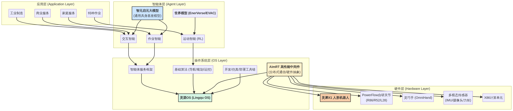

# 智元机器人开源技术栈深度调研

**作者**: Damon Li  
**日期**: 2025年12月03日  
**来源**: https://www.zhiyuan-robot.com/

## 1. 公司背景

### 1.1 公司概况

智元机器人致力以AI+机器人融合创新，打造全球领先的通用具身机器人产品及应用生态。公司成立于2023年2月，由全球著名企业家陈启源、人工智能领域顶尖科学家姜宇等产业人士共同创立。发展过程中，智元机器人得到了来自国家领导人的高度关怀，多次代表具身智能行业汇报发展进程。

### 1.2 核心定位与战略

依托行业领先的"一体三智"架构，智元以机器人本体为基，融合作业、交互、运动智能，推出了远征、精灵、灵犀三大机器人家族及业界首个通用具身基座模型"智元启元大模型"，是业内唯一实现全产品系列、全场景布局的机器人企业。智元机器人同步构建了领先的全栈生态体系，赋能伙伴发展，使能万千行业。

### 1.3 市场地位

凭借领先的产品技术与生态体系，智元机器人在全球率先实现了人形机器人的规模化量产和商业化落地。产品销往全球多个国家和地区。2025年1月，智元机器人第100台通用具身机器人正式量产下线，刷新行业记录。

## 2. 开源战略

智元机器人的核心特色是**全栈开源**战略，这在人形机器人行业中极为罕见。

### 2.1 开源组件概览

根据官网信息，智元机器人开源了以下核心组件：

1. **灵创平台** - 开发者平台
2. **灵心平台** - 核心平台
3. **AgiBot World 数据集** - 大规模机器人数据集
4. **智元灵尾X1** - 人形机器人产品
5. **AimRT通讯框架** - 机器人通讯中间件
6. **智元灵巧手** - 机器人灵巧手硬件

### 2.2 开源文档地址

官方开源文档地址：https://www.zhiyuan-robot.com/DOCS/OS

---

## 待深入调研内容

- [ ] 开源文档详细内容
- [ ] 技术架构细节
- [ ] 开源协议和使用方式
- [ ] 社区生态建设
- [ ] 与其他开源机器人项目的对比


## 3. 灵犀X1开源技术栈详解

### 3.1 硬件架构

#### 3.1.1 整机结构

灵犀X1全身包含**29个关节**，具体配置如下：

| 执行器型号 | 数量 | 应用部位 |
|-----------|------|---------|
| R86-2 | 9个 | 主要关节 |
| R86-3 | 6个 | 核心关节 |
| R52 | 10个 | 辅助关节 |
| L28 | 4个 | 小型关节 |
| 夹爪 | 2个 | 末端执行器 |

支持扩展头部3自由度，实现更丰富的交互能力。

#### 3.1.2 自研执行器

智元机器人自研了PowerFlow系列关节电机，具备以下核心特性：

- **中空走线设计**：优化内部布线，提升整洁度和可靠性
- **输出端绝对值编码**：提供精确位置反馈
- **PF-Link智能接口**：支持高速数据通信
- **MIT混合控制模式**：默认控制模式，兼顾性能和灵活性

#### 3.1.3 通讯架构

- **通讯协议**：全部执行器采用**CANFD通讯**
- **主控平台**：X86架构，运行Ubuntu 22.04实时系统
- **IMU传感器**：YIS320型号，波特率921600，串口通信
- **分布式架构**：基于AimRT中间件实现分布式群体实时通信

### 3.2 开源资料

智元机器人提供了**业界首家全栈开源**的人形机器人资料，总资料大小超过**1.2GB**。

#### 3.2.1 设计资料

开源内容包括：

1. **BOM清单**：完整的物料清单
2. **整机STEP文件**：3D模型文件
3. **整机图纸（SolidWorks）**：可编辑的设计图纸
4. **装机SOP**：标准作业程序文档

**下载渠道**：

- 百度云盘：https://pan.baidu.com/s/1UEdeDBTJiXRmIqMKwmO5RA?pwd=1234（提取码：1234）
- 谷歌云盘：https://drive.google.com/drive/folders/1MECbyKRJbnc_XKWsdUbn-70xmYFmw9FW?usp=sharing
- GitHub：https://github.com/AgibotTech/agibot_x1_hardware

#### 3.2.2 开源代码

智元机器人在GitHub上开源了完整的软件栈：

1. **推理代码**：https://github.com/AgibotTech/agibot_x1_infer
   - 基于AimRT框架构建
   - 包含模型推理、平台驱动、软件仿真等模块
   - 使用强化学习进行运动控制
   - 1.8k+ Stars，531 Forks

2. **训练代码**：https://github.com/AgibotTech/agibot_x1_train
   - 提供完整的训练流程
   - 支持强化学习算法

### 3.3 软件架构

#### 3.3.1 AimRT中间件

AimRT是智元机器人自研的**高性能开源中间件**，是灵犀X1软件栈的核心基础。

**核心特性**：

- **分布式实时通信**：支持多节点、多进程的高效通信
- **硬件抽象层**：屏蔽底层硬件差异，提供统一接口
- **模块化设计**：便于功能扩展和维护
- **高性能**：针对机器人实时性需求优化

**技术栈**：

- 主要语言：C++ (87.3%)
- 构建系统：CMake (8.0%)
- 脚本语言：Python (3.1%), Shell (1.6%)

#### 3.3.2 软件模块

根据GitHub仓库结构，灵犀X1的软件架构包含：

```
src/
├── assistant/        # ROS2仿真和示例项目
├── install/          # 配置脚本
├── module/           # 功能模块
├── pkg/              # 部署包
└── protocols/        # 通讯协议
```

**关键模块**：

1. **模型推理模块**：基于ONNX Runtime实现
2. **平台驱动模块**：硬件接口和控制
3. **仿真模块**：基于ROS2 Humble的虚拟仿真环境
4. **手柄控制模块**：支持游戏手柄操控

#### 3.3.3 开发流程

智元提供了完整的开发流程文档：

1. **执行器状态确认**：使用REF-CLI上位机软件配置执行器参数
2. **执行器桌面联调测试**：验证通讯和运动功能
3. **整机组装**：按照SOP和视频教程完成装配
4. **IMU调试**：配置YIS320传感器
5. **整机硬件部署**：电气安全检查和上电测试
6. **整机标零**：按照作业指导书完成零位标定
7. **整机软件部署**：部署推理代码并运行

### 3.4 灵渠OS操作系统

2025年7月，智元机器人在世界人工智能大会上正式发布了**业界首个具身智能操作系统**——**灵渠OS**。

#### 3.4.1 系统架构

灵渠OS采用**"南向适配具身硬件、北向支撑智能应用"**的生态架构：

**底层（南向）**：

- 基于AimRT中间件持续增强
- 提供分布式群体实时通信
- 硬件抽象层（HAL）
- 支持多模态传感器、具身组件（头部、灵巧手）、计算单元接入

**中层（操作系统核心）**：

- 导航、规划、运控（IL/RL）等基础算法能力
- 设备管理和资源调度
- 安全和权限管理

**上层（北向）**：

- 智能体服务框架
- 支持交互智能、作业智能、运动智能的标准化对接
- 降低应用开发门槛

**工具链**：

- 开发调试工具
- 仿真验证环境
- 部署管理平台
- 数据录制与分析

#### 3.4.2 核心特性

1. **高性能易扩展**：源自智元量产验证的产品技术框架
2. **面向具身硬件**：专为机器人场景优化
3. **量产验证**：已在智元多款产品中应用
4. **跨场景适配**：支持工业、商业服务、家庭服务等多领域

#### 3.4.3 开源策略

灵渠OS采用**"分层开源、共建共享"**模式：

- 逐步开放底层基础能力
- 开放上层智能服务框架
- 开放完整工具链
- 吸引产业链伙伴共同参与开发

这一模式借鉴了Android和Linux的成功经验，旨在构建繁荣的具身智能生态。

### 3.5 全栈技术架构图


*图：智元机器人全栈技术架构图*

## 4. 技术创新亮点

### 4.1 "一体三智"架构

智元机器人的核心技术架构为**"一体三智"**：

- **一体**：机器人本体（硬件平台）
- **三智**：
  - **作业智能**：任务执行和操作能力
  - **交互智能**：人机交互和语义理解
  - **运动智能**：运动规划和控制

### 4.2 启元大模型

智元推出了**业界首个通用具身基座模型"智元启元大模型"**，为机器人提供：

- 语义理解能力
- 常识推理能力
- 任务规划能力
- 多模态感知能力

### 4.3 世界模型创新

2025年5月，智元机器人发布了世界模型新突破：

- **EVAC框架**：基于动作序列驱动的世界模型
- **EWMBench**：具身智能世界模型评测基准
- 基于**EnerVerse世界模型架构**

### 4.4 全栈开源战略

智元机器人是**业内首家全栈开源人形机器人图纸和代码的公司**，开源内容包括：

1. 完整硬件设计（BOM、STEP、图纸）
2. 完整软件代码（推理、训练）
3. 中间件框架（AimRT）
4. 操作系统（灵渠OS）
5. 开发工具链

这种开源策略极大降低了人形机器人的研发门槛，有望推动行业快速发展。

## 5. 产业生态

### 5.1 产品矩阵

智元机器人形成了完整的产品矩阵：

1. **远征系列**：交互服务机器人（A2旗舰版、A2青春版）
2. **灵犀系列**：全智能灵动机器人（X1、X2、D1 Ultra、D1 Pro）
3. **精灵系列**：通用具身智能机器人（G1、G2）
4. **绝尘系列**：清洁机器人（C5）
5. **配件系列**：OmniHand灵巧手、VR设备

### 5.2 量产成就

- **2025年1月**：第100台通用具身机器人正式量产下线，刷新行业记录
- 产品销往全球多个国家和地区
- 实现了人形机器人的**规模化量产**和**商业化落地**

### 5.3 开源社区

- GitHub仓库获得1.8k+ Stars
- 531个Forks，活跃的开发者社区
- 提供完整的开发文档和视频教程
- 支持开发者DIY，成本约10万元

## 6. 技术对比与行业影响

### 6.1 与其他开源机器人项目对比

| 项目 | 开源程度 | 硬件开源 | 软件开源 | 操作系统 | 中间件 |
|------|---------|---------|---------|---------|--------|
| 智元灵犀X1 | ⭐⭐⭐⭐⭐ | ✅ 完整 | ✅ 完整 | ✅ 灵渠OS | ✅ AimRT |
| Boston Dynamics | ⭐ | ❌ | ❌ | ❌ | ❌ |
| Tesla Optimus | ⭐ | ❌ | ❌ | ❌ | ❌ |
| Unitree H1 | ⭐⭐⭐ | ⚠️ 部分 | ⚠️ 部分 | ❌ | ⚠️ 部分 |

智元机器人在**开源程度**上遥遥领先，是业内唯一实现**全栈开源**的人形机器人公司。

### 6.2 行业影响

1. **降低研发门槛**：开源资料使得中小企业和高校也能参与人形机器人研发
2. **加速技术迭代**：开源社区的贡献加速了技术创新
3. **推动成本下降**：有望在2-3年内将人形机器人成本降至5万元
4. **构建生态系统**：类似Android的开源模式，有望形成繁荣的产业生态

## 7. 未来展望

### 7.1 技术路线图

1. **灵渠OS持续演进**：逐步开放更多底层能力和工具链
2. **世界模型深化**：基于EVAC框架持续优化
3. **大模型集成**：深度整合启元大模型，提升智能化水平
4. **群体协同**：实现多机器人协同作业

### 7.2 应用场景拓展

- **工业制造**：柔性生产线、质检、搬运
- **商业服务**：餐饮、零售、酒店服务
- **家庭服务**：家政、陪伴、教育
- **特种作业**：救援、巡检、危险环境作业

### 7.3 生态建设

- 持续完善开源文档和教程
- 举办开发者大赛和技术交流活动
- 与高校和研究机构合作
- 建立开发者认证体系

---

## 参考资料

1. 智元机器人官网：https://www.zhiyuan-robot.com/
2. 灵犀X1开发指南：https://www.zhiyuan-robot.com/DOCS/OS
3. GitHub - agibot_x1_infer：https://github.com/AgibotTech/agibot_x1_infer
4. GitHub - agibot_x1_train：https://github.com/AgibotTech/agibot_x1_train
5. GitHub - agibot_x1_hardware：https://github.com/AgibotTech/agibot_x1_hardware
6. 灵渠OS发布报道：https://www.leaderobot.com/news/5934
7. 开源的风吹向了机器人：https://m.jfdaily.com/news/detail?id=868273
