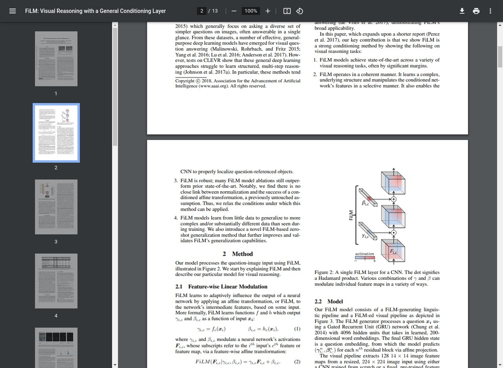
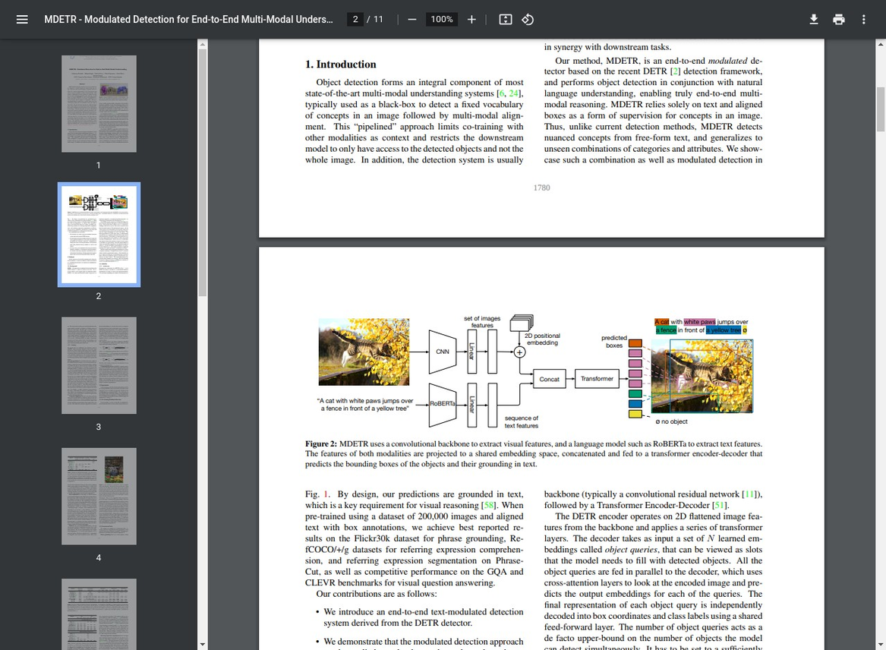
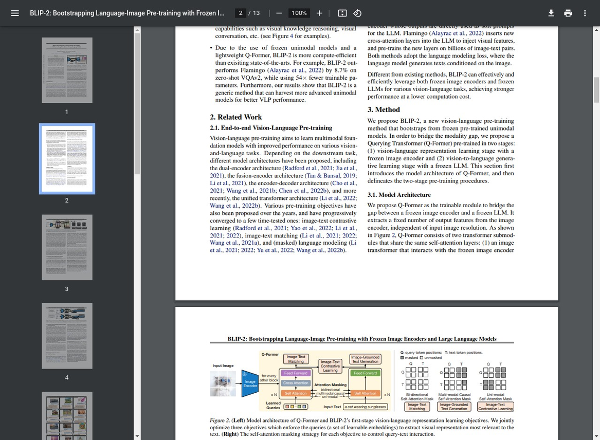

# 多模态与具身智能关键技术原理及创新发展趋势

**作者**: Damon Li
**日期**: 2025年12月03日

## 摘要

具身智能（Embodied AI）作为人工智能发展的下一波浪潮，正驱动着AI从数字世界向物理世界的深度融合。它强调智能体通过物理实体与环境进行实时交互、感知、决策和行动，从而形成一个完整的“感知-思考-行动”闭环。多模态技术的突破，特别是大型语言模型（LLM）与视觉、听觉、触觉等多种感知模态的结合，为具身智能的发展注入了核心动力。本文旨在深入探讨多模态与具身智能的关键技术原理，并分析其前沿创新发展趋势，为理解该领域的核心挑战与未来机遇提供专业视角。

---

## 1. 引言：从数字智能到物理智能的飞跃

传统的人工智能主要在软件和数字环境中运行，处理虚拟数据并执行数字任务。然而，物理世界中的复杂性、动态性和不确定性对AI提出了更高的要求。具身智能的出现，标志着AI研究范式的一次重要转变。它不再仅仅是算法的优化，而是软硬件系统的高度协同，旨在创造出能够在真实环境中自主学习和适应的智能体 [1]。

这一转变的核心驱动力源于多模态AI的进步。通过整合文本、图像、声音、触觉等多种信息源，AI能够更全面地理解环境状态，做出更精准的决策。正如卡内基国际和平研究院的报告所指出的，具身AI系统集成了先进的软件、复杂的传感器和精密的控制系统，使其具备高度的自主决策能力和对动态环境的适应性 [2]。

## 2. 具身智能的关键技术原理

具身智能系统的构建依赖于一个集成的技术栈，其核心在于实现感知、建模和决策三个层面的闭环。2025年发表于《机器人与人工智能前沿》的一篇综述性论文提出了一个名为“动态感知-任务自适应”（DP-TA）的三层理论框架，系统性地阐述了这一过程 [3]。

| 技术层面 | 核心原理 | 关键技术与挑战 |
| :--- | :--- | :--- |
| **多模态感知 (Perception)** | 融合来自不同传感器的异构数据，形成对环境的统一、连贯的理解。 | **跨模态对齐**：解决不同模态数据在语义和时空上的同步问题。<br>**不确定性建模**：处理传感器噪声、数据缺失和环境模糊性。<br>**实时处理**：在有限的计算资源下实现低延迟的数据融合。 |
| **世界建模 (Modeling)** | 基于感知数据构建关于物理世界的内部表征，预测环境动态变化和自身行动的后果。 | **因果推理**：理解物理规律和行为的因果关系，而非仅仅是相关性。<br>**状态预测**：在不完整信息下对未来状态进行准确预测。<br>**Sim-to-Real迁移**：将在仿真环境中学习到的模型有效迁移到真实世界。 |
| **策略与决策 (Decision)** | 根据世界模型和任务目标，生成并优化一系列行动策略，以实现长期目标。 | **分层规划**：将复杂任务分解为一系列可执行的子任务。<br>**自适应控制**：根据实时反馈动态调整行动策略。<br>**安全与鲁棒性**：确保在未知或危险情况下的安全行为。 |

### 2.1 多模态感知与跨模态对齐

多模态感知是具身智能的基础。然而，如何有效融合不同模态的信息，尤其是在存在不确定性的情况下，是一个核心挑战。研究人员提出了“特征条件化模态对齐”（F-CMA）机制，即利用一种模态的显式特征作为条件，来引导另一种模态的表征过程 [3]。这一思想催生了多种先进模型，下面将对其中的代表性工作进行深度解析。

#### 2.1.1 FiLM (Feature-wise Linear Modulation): 动态特征调制

FiLM是一种轻量级但功能强大的条件化方法，其核心思想是利用一个模态的信息（如文本指令）来动态地、逐特征地调整另一个模态（如视觉特征）的表示。这种调整通过一个简单的仿射变换实现，从而在不增加过多计算成本的情况下，实现跨模态的深度融合 [4]。

**技术原理与数学公式**

FiLM层对神经网络的中间特征图 `F` 进行操作。对于 `F` 中的每一个通道 `c`，FiLM都会根据条件输入 `x`（如问题文本的编码）生成一对调制参数：缩放因子 `γ_c` 和偏移因子 `β_c`。然后，这两个参数被用于对特征图进行仿射变换：

```math
\text{FiLM}(F_c | \gamma_c, \beta_c) = \gamma_c \cdot F_c + \beta_c
```

其中，`γ` 和 `β` 由一个独立的神经网络（FiLM生成器）根据条件输入 `x` 计算得出：

```math
(\gamma, \beta) = f(x)
```

`f(x)` 通常是一个循环神经网络（如GRU）或Transformer，用于处理序列化的文本输入。


*图1: FiLM层基本架构。来源: [4]*

**在具身智能中的应用**

在具身智能中，FiLM可以根据自然语言指令动态地调整机器人的视觉感知系统。例如，对于指令“请把那个小的红色方块递给我”，FiLM可以将“小”和“红色”这两个属性作为条件，增强视觉网络中对相应特征的敏感度，从而帮助机器人更准确地定位目标物体。

#### 2.1.2 MDETR (Modulated Detection Transformer): 端到端多模态检测

MDETR将目标检测任务重新定义为一个受语言调制的端到端问题。它借鉴了DETR（DEtection TRansformer）的架构，通过在Transformer编码器中实现视觉和语言特征的早期融合，使得模型能够根据自由形式的文本查询来定位图像中的对象 [5]。

**技术原理与架构**

MDETR的架构主要包括三个部分：

1.  **单模态编码器**: 使用CNN（如ResNet）提取图像特征，使用Transformer（如RoBERTa）提取文本特征。
2.  **跨模态融合编码器**: 将图像和文本特征投影到同一个嵌入空间，然后拼接在一起，共同输入到一个多层Transformer编码器中。在这个编码器内部，通过自注意力机制，视觉和文本特征可以进行深度的信息交互和对齐。
3.  **Transformer解码器**: 与DETR类似，使用一组可学习的对象查询（Object Queries）来从融合后的特征中解码出目标对象的位置和类别。


*图2: MDETR模型整体架构。来源: [5]*

**关键创新：软令牌预测与对齐**

为了实现文本短语和视觉区域的精确对齐，MDETR在预训练阶段引入了一个“软令牌预测”（Soft Token Prediction）损失。对于每一个检测到的对象，模型需要预测它对应于输入文本中的哪些词元（token），从而建立起细粒度的跨模态对应关系。

#### 2.1.3 BLIP-2: 基于Q-Former的高效视觉-语言预训练

BLIP-2提出了一种参数高效的预训练范式，其核心创新在于引入了一个名为**Querying Transformer (Q-Former)**的轻量级模块，用以桥接冻结的图像编码器和冻结的大型语言模型（LLM）之间的模态鸿沟 [6]。

**技术原理与两阶段预训练**

BLIP-2的 brilliance 在于它避免了对整个庞大模型进行端到端的训练，从而大大降低了计算成本。

1.  **第一阶段：视觉-语言表示学习**
    -   **目标**: 训练Q-Former从冻结的图像编码器中提取与文本最相关的视觉特征。
    -   **方法**: Q-Former使用一组可学习的查询向量，通过交叉注意力机制与图像特征交互。同时，通过图像-文本对比学习、图像-文本匹配和图像引导的文本生成这三个联合目标进行优化。

2.  **第二阶段：视觉到语言生成学习**
    -   **目标**: 将Q-Former的输出“翻译”成LLM能够理解的“软提示”。
    -   **方法**: 将Q-Former的输出通过一个全连接层投影，作为冻结的LLM的输入前缀，然后训练模型根据这些视觉提示生成相应的文本。


*图3: BLIP-2中的Q-Former架构及第一阶段预训练目标。来源: [6]*

**在具身智能中的价值**

BLIP-2的范式对于具身智能极具价值。它允许我们利用强大的、预训练好的LLM（如GPT-4）作为机器人的“大脑”，同时只训练一个轻量级的Q-Former来适配特定的机器人视觉系统。这使得机器人能够快速获得强大的零样本泛化和指令跟随能力，而无需从头开始训练一个庞大的多模态模型。

### 2.2 世界建模与Sim-to-Real

一个有效的世界模型能让智能体“预见”未来，从而做出更具前瞻性的决策。这需要模型不仅能记住过去，更能理解物理世界的因果规律。目前，基于视频生成、物理引擎和因果推断的世界模型是研究的热点。同时，Sim-to-Real（从仿真到现实）的迁移能力至关重要，因为它允许智能体在安全、高效的仿真环境中进行大量训练，然后将学到的知识应用于现实世界，从而大大降低了训练成本和风险 [7]。

## 3. 创新发展趋势

随着大模型技术的不断演进，具身智能正展现出几个显著的创新发展趋势。

### 3.1 大语言模型成为“具身大脑”

大型语言模型（LLM）正从纯粹的语言处理工具，演变为具身智能体的“中央处理器”或“大脑”。通过将LLM作为推理和规划的核心，研究人员可以利用其强大的常识知识和逻辑推理能力来理解复杂指令、分解任务和生成行动计划。例如，谷歌的PaLM-E和DeepMind的RT-2模型展示了如何将LLM与机器人控制相结合，使机器人能够理解抽象指令（如“把桌上的水果拿给我”）并将其转化为具体的物理动作 [8]。

### 3.2 端到端学习与模块化设计的融合

具身智能的实现路径存在两种范式：端到端（End-to-End）学习和模块化设计。端到端模型（如VLA模型）试图直接从原始传感器输入映射到动作输出，具有简洁和高集成度的优点，但可解释性和调试难度较大。模块化设计则将系统分解为感知、规划、控制等独立模块，易于开发和维护，但可能因模块间的信息损失而导致次优解。未来的趋势是将二者结合，利用端到端学习优化特定感知运动技能，同时通过模块化设计实现高层次的规划和推理，形成“大小脑”协同的架构 [9]。

### 3.3 人形机器人成为终极平台

人形机器人因其与人类环境的高度兼容性，被认为是具身智能的终极物理载体。特斯拉的Optimus、Figure AI的Figure 01以及中国优必选的Walker系列等项目，都在积极探索将先进的AI模型与复杂的人形硬件相结合。中国政府已将具身智能，特别是人形机器人，视为未来产业的战略制高点，并写入了《“十四五”机器人产业发展规划》和2025年的政府工作报告，旨在推动其在制造业、服务业和特种作业中的应用 [2]。

### 3.4 安全、伦理与治理成为核心议题

随着具身智能体能力的增强，其带来的安全和伦理风险也日益凸显。这些风险不仅包括物理伤害、隐私泄露等直接威胁，还涉及决策偏见、责任归属等复杂的社会问题。因此，构建完善的安全治理框架成为当务之急。中国发布的《人工智能安全治理框架2.0》便是一个例证，它系统性地划分了技术内生风险和应用层面风险，并提出了全生命周期的治理措施 [10]。可以预见，未来的技术创新将与安全设计和伦理规范更加紧密地结合在一起。

## 4. 结论

多模态与具身智能正处在一个技术爆发与产业应用的前夜。从多模态感知、世界建模到大模型驱动的决策，其关键技术原理正在不断成熟。未来，随着LLM作为“大脑”能力的持续增强，以及人形机器人等硬件平台的逐步完善，具身智能将在工业自动化、家庭服务、医疗健康等领域释放巨大潜力。然而，要实现这一愿景，仍需在Sim-to-Real迁移、系统安全性和社会伦理等方面取得持续突破。一个更加智能、更加自主、与人类社会深度融合的具身智能时代正加速到来。

---

## 参考文献

[1] Wayve. (2024). *The Road to Embodied AI*. [Online]. Available: https://wayve.ai/thinking/road-to-embodied-ai/

[2] Carnegie Endowment for International Peace. (2025). *Embodied AI: China’s Big Bet on Smart Robots*. [Online]. Available: https://carnegieendowment.org/research/2025/11/embodied-ai-china-smart-robots?lang=en

[3] Zhang, Y., et al. (2025). *A review of embodied intelligence systems: a three-layer framework integrating multimodal perception, world modeling, and structured strategies*. Frontiers in Robotics and AI. [Online]. Available: https://pmc.ncbi.nlm.nih.gov/articles/PMC12631203/

[4] Perez, E., et al. (2022). *FiLM: Visual Reasoning with a General Conditioning Layer*. arXiv. [Online]. Available: https://arxiv.org/abs/1709.07871

[5] Kamath, A., et al. (2021). *MDETR - Modulated Detection for End-to-End Multi-Modal Understanding*. arXiv. [Online]. Available: https://arxiv.org/abs/2104.12763

[6] Li, J., et al. (2023). *BLIP-2: Bootstrapping Language-Image Pre-training with Frozen Image Encoders and Large Language Models*. arXiv. [Online]. Available: https://arxiv.org/abs/2301.12597

[7] Zhao, Y., et al. (2025). *Embodied AI: From LLMs to World Models*. arXiv. [Online]. Available: https://arxiv.org/html/2509.20021v1

[8] Driess, D., et al. (2023). *PaLM-E: An Embodied Multimodal Language Model*. arXiv. [Online]. Available: https://arxiv.org/abs/2303.03378

[9] Intel. (2025). *英特尔® 具身智能大小脑融合方案加速产业创新与方案交付*. [Online]. Available: https://www.intel.cn/content/dam/www/central-libraries/cn/zh/documents/2025-04/25-eai-accelerating-industry-innovation-and-solution-delivery-with-body-intelligent-brain-convergence-solutions-whitepaper.pdf

[10] 全国网络安全标准化技术委员会. (2025). *人工智能安全治理框架2.0*. [Online]. Available: https://www.tc260.org.cn/upload/2025-09-15/1757911253996041369.pdf
